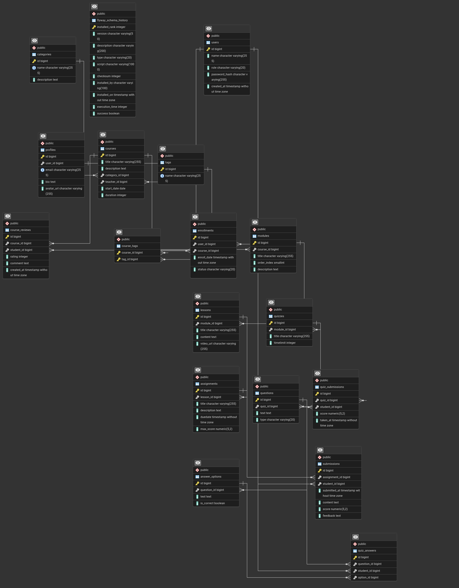
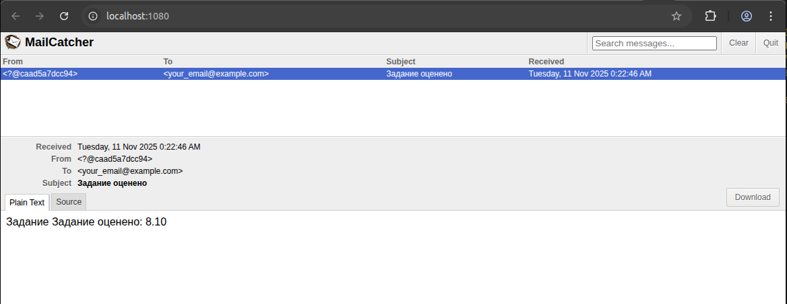

# hibernate-learning-project
Веб-приложение на базе Spring Boot, которое использует Hibernate/JPA для доступа к базе данных PostgreSQL



## Возможности
- Управление курсами и контентом (создание курсов, модулей, уроков, привязка преподавателя к курсу, категоризация курсов).
- Регистрация студентов на курсы и роли пользователей (студенты vs преподаватели, возможно администраторы).
- Работа с учебными заданиями: создание заданий к урокам, загрузка решений студентами, оценивание.
- Проведение тестирования (quiz): создание тестов с вопросами и вариантами ответов, прохождение тестов студентами, сохранение результатов.
- Обработка ленивой загрузки: определить, в каких случаях доступ к связанным данным требует особого внимания (например, получение списка уроков курса вне сессии) и как вы будете решать эти ситуации (через настройку fetch = LAZY/EAGER, использование JOIN FETCH в запросах, или транзакционных методов сервиса).
- Возможность отправки уведомлений о оценке заданий через Email

## Требования
- Java 21+
- Gradle
- Docker compose

## Сборка и запуск
Запустить при помощи docker-compose (сборка приложения выполняется при сборке контейнера):
```bash
docker compose up --detach
```
При запуске поднимается база данных PostgreSQL 17 и PGAdmin для администрирования БД
При старте приложения выполняется ряд SQL-скриптов для инициализации БД и наполнения данными при помощи Flyway
В качестве сервера SMTP для рассылки уведомлений используется MailCatcher (http://localhost:1080/ для просмотра Email)


## Конфигурация JWT
Используется симметричный ключ HMAC, секрет задаётся свойством `security.token.signing.key` в
`src/main/resources/application.yaml`, это свойство распространяется на конфигурации всех сервисов
Свойство `security.token.expiration.minutes` задает время жизни токена

## Пример сценария 
1) Регистрация пользователя
```bash
curl -X POST http://localhost:8080/api/auth/sign/up \
  -H 'Content-Type: application/json' \
  -d '{
  "username": "Viktor",
  "password": "password123",
  "role": "Студент"
}'
```
2) Вход и получение JWT
```bash
TOKEN=$(curl -s -X POST "http://localhost:8080/api/auth/sign/in" \
  -H 'Content-Type: application/json' \
  -d '{
  "username": "Viktor",
  "password": "password123"
}' | jq -r .token)
```
3) Просмотр курсов
```bash
curl -X GET http://localhost:8080/api/courses \
  -H "Authorization: Bearer $TOKEN" \
  -H 'Content-Type: application/json'
```
4) Записаться на курс
```bash
curl -X POST http://localhost:8080/api/courses/enrollment \
  -H "Authorization: Bearer $TOKEN" -H 'Content-Type: application/json' \
  -d '{
  "course": "Математика"
}'
```
3) Просмотр записей на курсы
```bash
curl -X GET http://localhost:8080/api/courses/enrollments \
  -H "Authorization: Bearer $TOKEN" \
  -H 'Content-Type: application/json'
```

## Основные эндпойнты
### REST API: Пользователь
* `PUT` `/api/users/user/{id}/set-admin` Добавить роль ADMIN пользователю
* `GET` `/api/users/user/profile` Просмотр профиля
* `PUT` `/api/users/user/profile` Редактирование профиля
* `PUT` `/api/users/user/edit` Редактирование пользователя
* `GET` `/api/users/user/{id}` Информация о пользователе
* `GET` `/api/users` Список всех пользователей, кроме администраторов
* `DELETE` `/api/users/user/{id}` Удаление пользователя

### REST API: Ответы на задания
* `PUT` `/api/submissions/submission/{id}/grade` Оценить решение
* `POST` `/api/submissions/submission` Добавить ответ на задание
* `GET` `/api/submissions/submission/{id}` Просмотреть решение по id
* `DELETE` `/api/submissions/submission/{id}` Удалить решение
* `GET` `/api/submissions/student/{studentId}` Получить все решения конкретного студента
* `GET` `/api/submissions/assignment/{assignmentId}` Получить все решения по конкретному заданию

### REST API: Управление курсами
* `PUT` `/api/courses/enrollment/{id}` Завершить запись на курс
* `DELETE` `/api/courses/enrollment/{id}` Удалить запись на курс
* `GET` `/api/courses/course/{id}/tag` Список тегов курса
* `PUT` `/api/courses/course/{id}/tag` Добавить тег для курса
* `DELETE` `/api/courses/course/{id}/tag` Убрать тег у курса
* `POST` `/api/courses/enrollment` Записаться на курс
* `POST` `/api/courses/course` Зарегистрировать курс
* `POST` `/api/courses/course/{id}/review` Добавить отзыв на курс
* `GET` `/api/courses/find` Поиск курсов по тегу
* `GET` `/api/courses/enrollments` Список записей на курсы
* `GET` `/api/courses/course/{id}` Курс по ID
* `DELETE` `/api/courses/course/{id}` Удалить курс
* `GET` `/api/courses/course/{id}/reviews` Посмотреть отзывы на курс
* `GET` `/api/courses` Список курсов

### REST API: Аутентификация
* `PUT` `/api/auth/password/change` Смена пароля пользователя
* `POST` `/api/auth/sign/up` Регистрация пользователя
* `POST` `/api/auth/sign/in` Авторизация пользователя

### REST API: Тесты
* `POST` `/api/quizes/submission` Добавить результат
* `POST` `/api/quizes/quiz` Добавить тест
* `GET` `/api/quizes/submission/{id}` Результат по ID
* `DELETE` `/api/quizes/submission/{id}` Удалить результат
* `GET` `/api/quizes/quiz/{id}` Тест по ID
* `DELETE` `/api/quizes/quiz/{id}` Удалить тест
* `GET` `/api/quizes/quiz/{id}/submissions` Список результатов
* `GET` `/api/quizes` Список тестов

### REST API: Вопросы
* `POST` `/api/questions/student-answer` Добавить ответ студента
* `POST` `/api/questions/question` Добавить вопрос
* `POST` `/api/questions/answer` Добавить вариант
* `GET` `/api/questions/question/{id}` Вопрос по ID
* `DELETE` `/api/questions/question/{id}` Удалить вопрос
* `GET` `/api/questions/question/{id}/student-answers` Посмотреть ответы студента
* `GET` `/api/questions/question/{id}/answers` Список вариантов
* `GET` `/api/questions/answer/{id}` Вариант ответа по ID
* `DELETE` `/api/questions/answer/{id}` Удалить вариант
* `GET` `/api/questions` Список вопросов

### REST API: Модули
* `POST` `/api/modules/module` Добавить модуль
* `GET` `/api/modules/module/{id}` Задание по ID
* `DELETE` `/api/modules/module/{id}` Удалить модуль
* `GET` `/api/modules` Список модулей

### REST API: Занятия
* `POST` `/api/lessons/lesson` Добавить занятие
* `GET` `/api/lessons/lesson/{id}` Занятие по ID
* `DELETE` `/api/lessons/lesson/{id}` Удалить занятие
* `GET` `/api/lessons` Список занятий

### REST API: Управление категориями
* `POST` `/api/categories/category` Зарегистрировать категорию
* `GET` `/api/categories/category/{id}` Категория по ID
* `DELETE` `/api/categories/category/{id}` Удалить категорию
* `GET` `/api/categories` Список категорий

### REST API: Задания
* `POST` `/api/assignments/assignment` Добавить задание
* `GET` `/api/assignments/assignment/{id}` Задание по ID
* `DELETE` `/api/assignments/assignment/{id}` Удалить задание
* `GET` `/api/assignments` Список заданий


## Консоль PGAdmin
- `http://localhost:5050/browser/`, база данных `jdbc:postgresql://localhost:5432/exam_db` логин `admin` пароля `admin`

## Swagger / OpenAPI
- Swagger UI: `http://localhost:8080/swagger-ui/index.html#/`

## Тестирование
У тестов свои настройки, для тестов поднимается база H2
- UserControllerTest - тестирование операций с пользователями
- CourseControllerTest - тестирование различных операций: добавление категорий, курсов, модулей, уроков, заданий, вариантов ответов заданий, тестов, вопросов тестов, ответов на вопросы
- UserServiceTest - тест сервиса пользователей, этот тест демонстрирует что получим LazyInitializationException при попытке обратиться к Lazy коллекции вне сессии
  Каждый тест содержит проверку работы эндпоинтов, а также негативный сценарий

